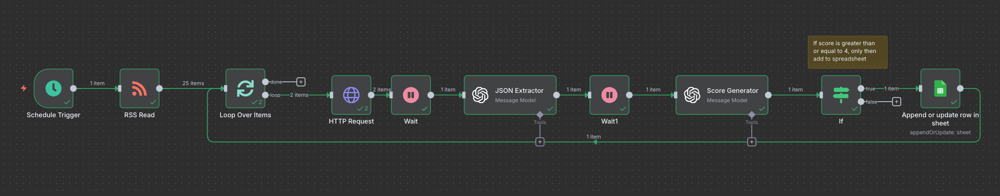

# LinkedIn_Job_Match_Automation | Resume-Based Job Scorer

This system runs end-to-end job discovery and triage using **n8n**, **OpenAI**, and **Google Sheets**. It ingests LinkedIn-style RSS items, pulls each posting’s page, extracts clean fields, scores fit against your resume, and writes only relevant roles to a sheet.

## About n8n and why it’s used
**n8n** is a self-hosted automation platform. I used it to chain **RSS → HTTP → LLM → Sheets** with low code, reproducible runs, and full control of keys and cost.

---

## Job Filtering Workflow

## Visual Workflow

### Objective
- Collect job descriptions from public RSS feeds.  
- Evaluate resume fit with an LLM.  
- Skip low-match roles using a threshold.  
- Persist qualified roles to Google Sheets for review.

---

## How to Use

You can import the ready workflow JSON or assemble it yourself.

### Option 1: Import the provided workflow
1. Clone/download this repo.  
2. Open your n8n instance.  
3. **Import** `Linkedin_Job_Match_Automation.json`.  
4. Create credentials:
   - **OpenAI** API key
   - **Google Sheets** OAuth2
5. In the scoring node, paste your latest **resume text** into the prompt.  
6. In the Sheets node, select your Spreadsheet and Sheet.  
7. Run once manually or enable the **Schedule**.

### Option 2: Build it manually in n8n
**Step 1 — Ingest**
1) **Schedule Trigger**: pick a daily time (server TZ).  
2) **RSS Read**: point to a LinkedIn/other feed for your role/location filters.  
3) **Loop over (Split in Batches)**: cap items per run (e.g., 1).

**Step 2 — Score relevance**
4) **Loop items**: iterate each RSS entry.  
5) **HTTP Request**: fetch job page HTML via the link.  
6) **Wait**: brief delay (5–10s) to control rate limits.  
7) **OpenAI (JD vs Resume)**: return:
   - `score` (0–5)  
   - `rationale` (≤60 words)  
   - `gaps` (list)  
   - `matched_skills` (list)
8) **If**: continue only if `score >= 4` (tune as needed).

**Step 3 — Normalize + write**
9) **Wait**: optional short delay.  
10) **OpenAI or Code**: extract fields (Title, Company, Location, Skills, etc.).  
11) **Code (optional)**: shape a row object for Sheets.  
12) **Google Sheets**: append or upsert by `Link` to avoid duplicates.

---

### Technologies

- n8n for orchestration
- OpenAI for parsing and scoring
- Google Sheets API for storage
- RSS as the job source

### Prerequisites

- OpenAI API access
- Google account with Sheets access
- n8n instance (local, Docker, or hosted)
- Resume text ready to embed in the scoring prompt

### Recommended Sheet Columns

Link (unique), Title, Date, Job Description, Exp Years Required, Type Of Job, Skills, Education Required, Salary Range, Work Arrangement, Location, Company Name, Benefits, Visa Sponsorship, Score, Gaps, Matched Skills, Rationale.

### Author

- Gowtham Chandrasekaran
- Portfolio: www.gowthamchandrasekaran.com
